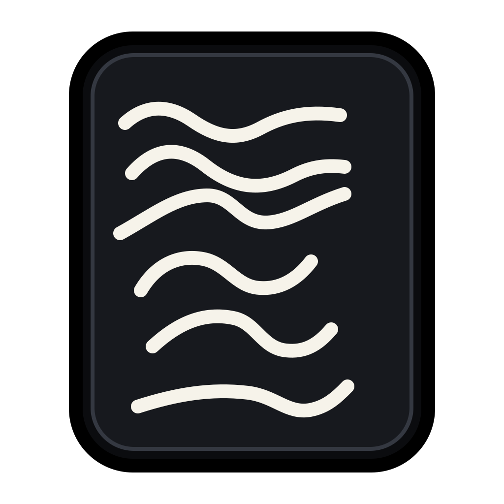
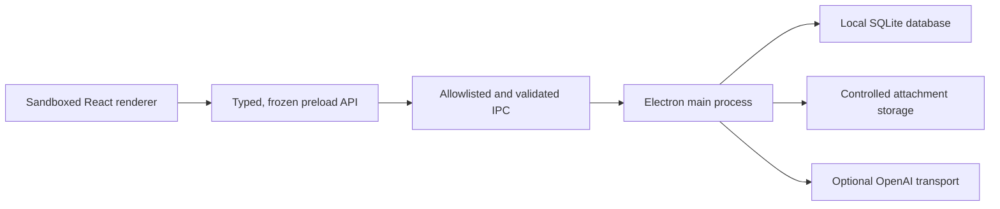

<p align="center">
  
</p>

<h1 align="center">WovenNote</h1>

<p align="center">
  A local-first Windows notebook for text, images, PDFs, videos, links, and optional AI.
</p>

<p align="center">
  <a href="https://github.com/YusufHasanSaygili/WovenNote/releases/latest"><strong>Download for Windows</strong></a>
  ·
  <a href="https://github.com/YusufHasanSaygili/WovenNote/issues">Report a problem</a>
</p>

<p align="center">
  
  
  
  <a href="LICENSE"></a>
</p>

WovenNote is a desktop notes application for people who want rich documents without giving up local ownership. Notes stay on your computer, the core app works without an account, and an API key is needed only for the optional AI features.

## Why WovenNote?

Most basic note apps stop at formatted text or require a cloud account. WovenNote combines a visual note board, a block-style rich editor, local multimedia, durable backups, and note-aware AI in one offline-capable desktop app.

| Capability     | WovenNote                                                       | Typical basic note app              |
| -------------- | --------------------------------------------------------------- | ----------------------------------- |
| Data ownership | Local SQLite database and local attachments                     | Often account or cloud dependent    |
| Note layout    | Draggable, resizable cards in grid or list view                 | Fixed list                          |
| Rich media     | Images, PDFs, local video, files, and YouTube embeds            | Usually images and links only       |
| Recovery       | Autosave, note version history, trash, and full backups         | Basic autosave                      |
| AI             | Optional chat and inline actions using the open note as context | Missing, cloud-locked, or always-on |
| Offline use    | All non-AI features                                             | Varies                              |

## Features

- Rich text editing with headings, lists, tasks, quotes, code blocks, tables, colors, and alignment
- Responsive board with draggable and resizable note cards
- Grid and list views with persistent layout preferences
- JPG/JPEG, PNG, GIF, WebP, PDF, MP4, WebM, Office, ZIP, and text attachments
- Embedded YouTube videos and movable media blocks
- Autosave with recoverable note version history
- Full-text search, tags, pinning, favorites, archive, and trash
- Markdown, plain text, versioned JSON, and PDF export
- Checksum-validated full-library backup and transactional restore
- Turkish and English interface languages
- Light, dark, and system themes
- Menu zoom and <kbd>Ctrl</kbd> + mouse-wheel zoom
- Optional note-aware AI chat and inline AI actions

## Install on Windows

WovenNote currently targets Windows 10/11 x64.

1. Open the [latest GitHub release](https://github.com/YusufHasanSaygili/WovenNote/releases/latest).
2. Download `WovenNote.Setup.0.1.7.exe`.
3. Run the installer and choose an installation directory.
4. Launch WovenNote from the desktop or Start menu shortcut.

The current installer is not code-signed, so Windows SmartScreen may show an unknown-publisher warning. Download releases only from this repository and verify the published SHA-256 checksum.

## OpenAI API: optional, not required for notes

WovenNote's editor, attachments, search, organization, export, backup, and restore features work without an API key and without internet access.

AI chat and inline AI actions require:

- your own OpenAI API key;
- network access; and
- available API billing or credits.

ChatGPT Plus does **not** include OpenAI API usage. API usage is billed separately by OpenAI. Configure the key under **AI settings**, save it, and use **Test connection** to verify it.

On Windows, the key is encrypted with Electron `safeStorage`. It is handled only by the main process and is not returned to the renderer, stored in SQLite, included in backups, or written to logs. Automated tests use fake transports and never make paid API requests.

## Local data and backups

Application data is stored under:

```text
%APPDATA%\WovenNote
```

The **Backup** action creates a `.wovennote-backup` archive containing notes, tags, layouts, attachments, chat history, and note versions. Archives are versioned and checksum-validated before restore. The OpenAI API key is never included.

WovenNote can migrate data from its pre-rename application profile and can read compatible backups from those earlier builds. The source data is left untouched.

## Development

### Requirements

- Windows x64
- Node.js 22.12 or newer
- npm 10 or newer

### Run locally

```powershell
git clone https://github.com/YusufHasanSaygili/WovenNote.git
cd WovenNote
npm ci
npm run dev
```

### Quality checks

```powershell
npm run format:check
npm run lint
npm run type-check
npm test
npm run test:smoke
npm run build
```

### Build the Windows installer

```powershell
npm run package:win
```

The unpacked application and NSIS installer are written to `release/`. Generated binaries are intentionally excluded from git and distributed through [GitHub Releases](https://github.com/YusufHasanSaygili/WovenNote/releases).

## Architecture and security



The renderer cannot directly access Node.js, the filesystem, SQLite, raw IPC, or the stored API key.

- `contextIsolation: true`
- `nodeIntegration: false`
- Renderer sandbox enabled
- Explicit IPC channel allowlist with Zod input/output validation
- Strict Content Security Policy without inline or evaluated scripts
- Controlled attachment protocol with path-traversal protection
- Navigation, popups, webviews, and unexpected permission requests blocked
- Secrets excluded from exports, backups, logs, and git

Additional technical decisions are documented in [`docs/`](docs/).

## Current limitations

- Windows x64 only
- No cloud sync, collaboration, or account system
- Installer is not code-signed
- Attachments are limited to 100 MiB each
- AI features require network access and a separately billed OpenAI API account

## Contributing

Bug reports and focused pull requests are welcome. Read [CONTRIBUTING.md](CONTRIBUTING.md) before submitting a change. Please report security issues through the private process in [SECURITY.md](SECURITY.md).

## License

WovenNote is open-source software licensed under the [MIT License](LICENSE).
